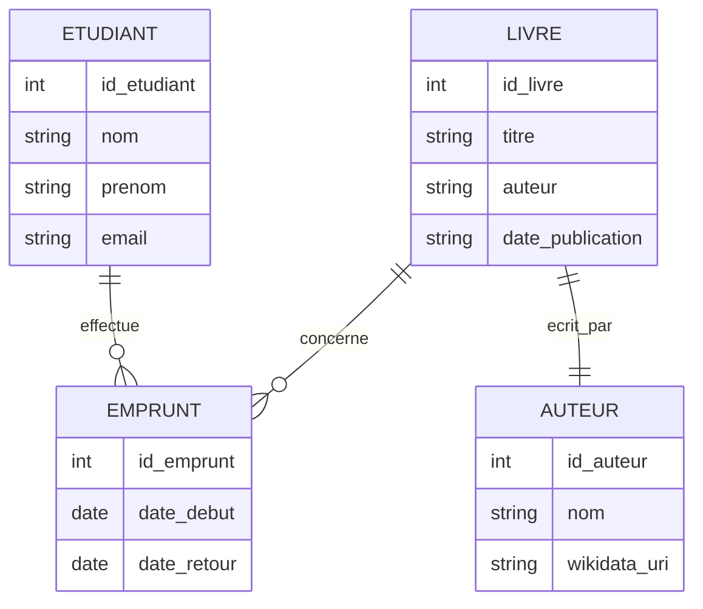

# 📚 Gestion d’une bibliothèque d’étudiants

## 🎯 Description du projet

Ce projet a pour objectif de développer une application web permettant la **gestion d’une bibliothèque universitaire**.  
Elle facilite le **suivi des prêts de livres** par les étudiants et permet de **relier les auteurs à leurs identifiants Wikidata** grâce au format **RDF/Turtle**.  

L’application met en œuvre plusieurs langages du Web (SQL, PHP, JavaScript, RDF, Markdown) et propose une interface simple pour :
- enregistrer les étudiants, les livres et les emprunts,  
- visualiser les relations entre les entités via un diagramme,  
- exploiter les données en lien avec des ressources du web sémantique (Wikidata).  

---

## 👥 Public cible
- Étudiants  
- Chercheurs  
- Communauté universitaire  

---

## ⚙️ Technologies utilisées

### **Front-End**
- HTML5  
- CSS3  
- JavaScript  
- D3.js *(visualisation de données)*  

### **Back-End**
- PHP  

### **Base de données**
- MySQL  

### **Données & Web sémantique**
- RDF / Turtle  
- JSON  

### **Outils & environnement**
- Git / GitHub  
- Markdown  
- Mermaid (diagramme)  

---

## 📊 Diagramme entité-relation (Mermaid)



---

## 🧩 Fonctionnalités prévues
- Gestion des étudiants et des livres (CRUD)  
- Suivi des emprunts (ajout, retour)  
- Liaison RDF avec Wikidata (auteurs)  
- Visualisation des relations avec D3.js  
- Documentation claire en Markdown  

---

## 🧠 Exemple RDF / Turtle
```turtle
@prefix ex: <http://example.org/library#> .
@prefix wd: <https://www.wikidata.org/entity/> .

ex:Livre1 a ex:Livre ;
    ex:titre "Apprendre le Python" ;
    ex:auteur wd:Q28865 .
```

---

## 📦 Installation
1. Cloner le projet :
   ```bash
   git clone https://github.com/<ton-nom-utilisateur>/projet-bibliotheque.git
   ```
2. Importer la base MySQL avec le fichier `database.sql`
3. Configurer la connexion dans `config.php`
4. Lancer un serveur local :
   ```bash
   php -S localhost:8000
   ```

---

## ✨ Auteur
Projet réalisé par **Kamli Mohamed**  
Étudiant en M2 THYP – Paris 8  
2025  
